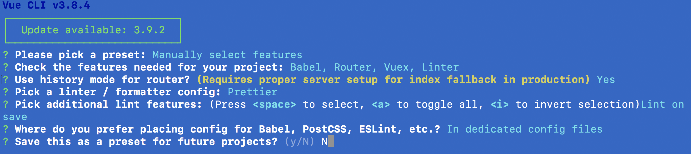

# Using vue cli

## Create app

```
vue create vue-graphql
```

## Settings



## VS Code

- Vetur extension
- ESLint
- Prettier

## Edit .eslintrc.js

```javascript
module.exports = {
  root: true,
  env: {
    node: true
  },
  extends: [
    'plugin:vue/essential',
    'plugin:prettier/recommended', // we added this line
    '@vue/prettier'
  ],
  rules: {
    'no-console': process.env.NODE_ENV === 'production' ? 'error' : 'off',
    'no-debugger': process.env.NODE_ENV === 'production' ? 'error' : 'off'
  },
  parserOptions: {
    parser: 'babel-eslint'
  }
}
```

### Add .prettierrc.js

```javascript
module.exports = {
  singleQuote: true,
  semi: false
}
```

### Create .vscode folder and Add settings.json

```javascript
{
  "vetur.validation.template": false,
  "eslint.validate": [
    {
      "language": "vue",
      "autoFix": true
    },
    {
      "language": "html",
      "autoFix": true
    },
    {
      "language": "javascript",
      "autoFix": true
    }
  ],
  "eslint.autoFixOnSave": true,
  "editor.formatOnSave": true
}
```

# vue-cli settings

## Project setup

```
yarn install
```

### Compiles and hot-reloads for development

```
yarn run serve
```

### Compiles and minifies for production

```
yarn run build
```

### Run your tests

```
yarn run test
```

### Lints and fixes files

```
yarn run lint
```

### Customize configuration

See [Configuration Reference](https://cli.vuejs.org/config/).
